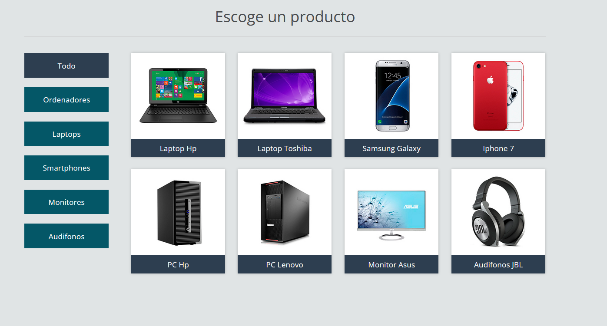
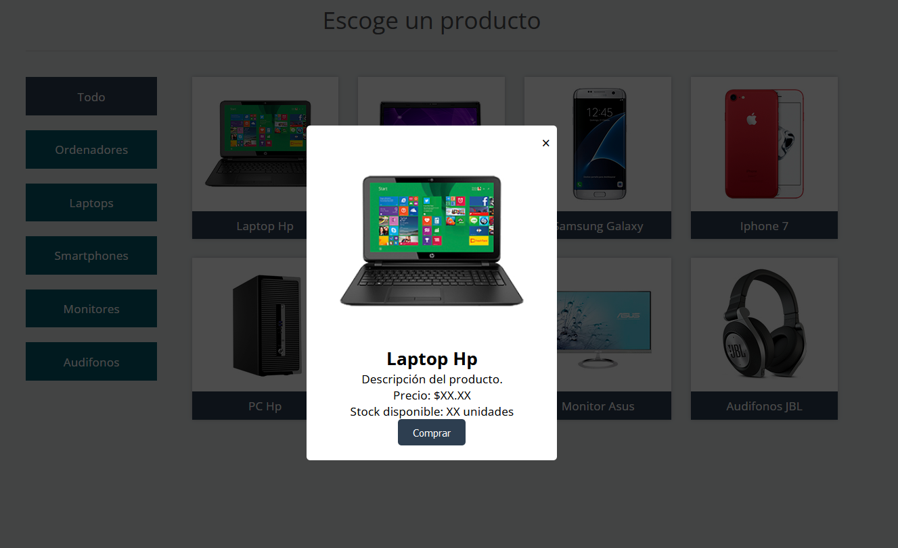
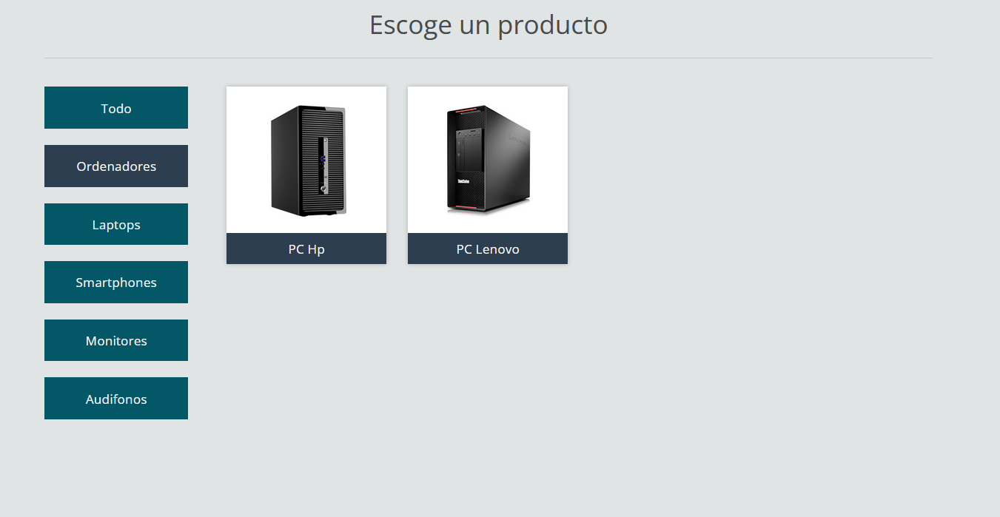
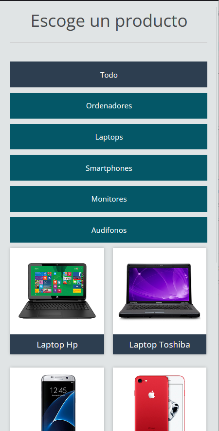

## 👍Agradecimientos y Contribución

Este proyecto se basa en el tutorial de **CodyTron**, un creador de contenido en YouTube. Agradecemos a **CodyTron** por proporcionar un tutorial detallado sobre cómo crear un filtro de elementos por categorías. Puedes encontrar el video tutorial original en su [canal de YouTube](https://www.youtube.com/watch?v=UH7Xtn4J5ZM).

Hemos modificado y adaptado el código del tutorial original para crear este proyecto. Agradecemos a **CodyTron** por compartir su conocimiento y recursos.

## 📦Descargar el Proyecto Original sin Cambios.

Si deseas obtener una copia de este proyecto, puedes descargarlo [aquí](https://www.mediafire.com/file/cc98g19amm721s6/Filtrando_elemetos.rar).

# 🔍Filtrando elementos por categorías

Este es un proyecto de muestra que muestra cómo filtrar elementos por categorías utilizando HTML, CSS y JavaScript con jQuery.

## 🚧Características

- Filtrado de productos por categoría.
- Ventana modal con detalles del producto.
- Diseño minimalista y responsive.
- Facilidad de uso.

## 🦾Uso del Proyecto Modificado:

1. Descarga o clona este repositorio en tu computadora.
2. Abre el archivo `index.html` en tu navegador web.
3. Escoge una categoría haciendo clic en uno de los enlaces en la lista de categorías.
4. Haz clic en un producto para ver sus detalles en una ventana modal.

## ⚙️Tecnologías utilizadas

- HTML
- CSS
- JavaScript
- jQuery

## 🌍Capturas de Pantalla

## 👍Contribuir

Si deseas contribuir a este proyecto, siéntete libre de hacer un fork y enviar pull requests.

## 👅Licencia

Este proyecto está bajo la Licencia MIT. Consulta el archivo [LICENSE](LICENSE) para más detalles.

---

**Nota:** Este es un proyecto de muestra y no representa un producto o sitio web real. Los detalles de productos, imágenes y descripciones son ficticios.

¡Gracias por revisar este proyecto! Si tienes alguna pregunta o sugerencia, no dudes en contactarnos.
